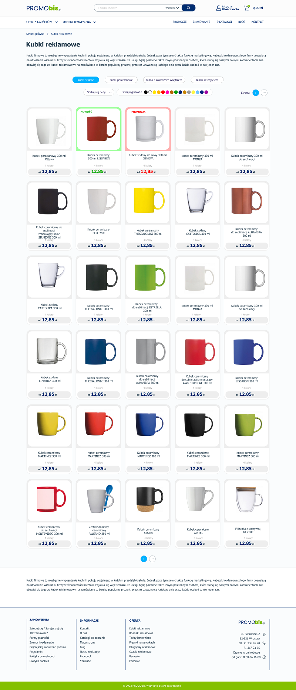
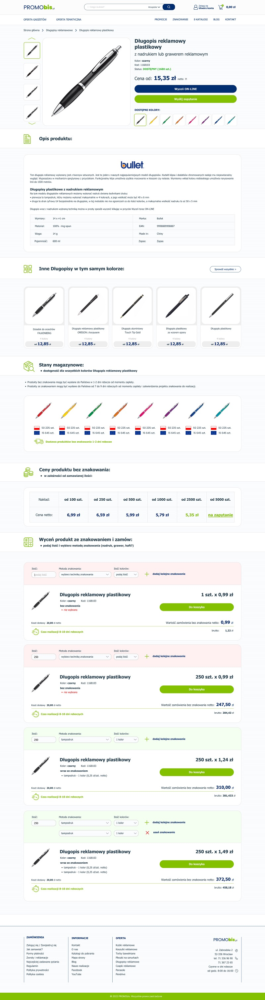
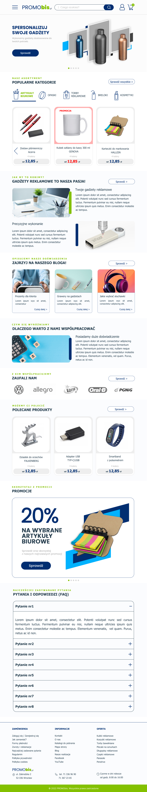
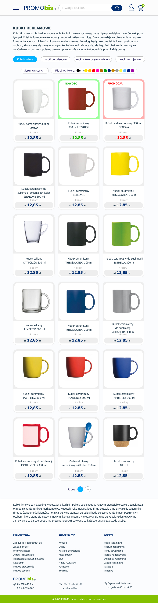
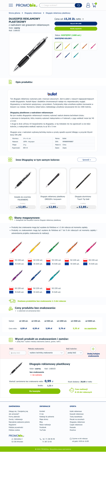

## Table of contents
* [General info](#general-info)
* [Technologies](#technologies)
* [Live](#live-star2)
* [Screenshots](#screenshots)

## General info
PROMObis.pl e-commerce shopwebsite

## Technologies   
Used technologies:
* JavaScript
* HTML5
* SCSS

## Live :star2:
* Maipage :arrow_right: https://goldipl.github.io/PROMObis.pl/    

* Category :arrow_right: https://goldipl.github.io/PROMObis.pl/category   

* Product page :arrow_right: https://goldipl.github.io/PROMObis.pl/product   

* Cart page :arrow_right: https://goldipl.github.io/PROMObis.pl/cart    

* Cart person data page :arrow_right: https://goldipl.github.io/PROMObis.pl/cart-your-data-person    

* Cart company data page :arrow_right: https://goldipl.github.io/PROMObis.pl/cart-your-data-company    

* New account page :arrow_right: https://goldipl.github.io/PROMObis.pl/cart-new-account    

* Cart summary page :arrow_right: https://goldipl.github.io/PROMObis.pl/cart-summary    

* Offerts page :arrow_right: https://goldipl.github.io/PROMObis.pl/offerts    

* Account page :arrow_right: https://goldipl.github.io/PROMObis.pl/account    

* Account send offerts page :arrow_right: https://goldipl.github.io/PROMObis.pl/account_send_offerts   

* Account save offerts page :arrow_right: https://goldipl.github.io/PROMObis.pl/account_save_offerts    

* Account pricing page :arrow_right: https://goldipl.github.io/PROMObis.pl/account_pricing    

* Account pricing details page :arrow_right: https://goldipl.github.io/PROMObis.pl/account_pricing_details    

* Account orders page :arrow_right: https://goldipl.github.io/PROMObis.pl/account_orders    

* Account orders details page :arrow_right: https://goldipl.github.io/PROMObis.pl/account_orders_details    

* Account files page :arrow_right: https://goldipl.github.io/PROMObis.pl/account_files    

* Account no files page :arrow_right: https://goldipl.github.io/PROMObis.pl/account_no_files    

* Contact page :arrow_right: https://goldipl.github.io/PROMObis.pl/contact    

## Screenshots
* Desktop version :desktop_computer:   

  

    

   

* Tablet version :computer:   

  

    

 

* Mobile version :iphone:      

  

    

 