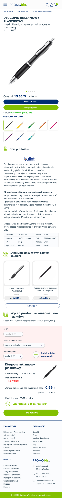

    

<h1 align="center">PROMObis website</h1>

E-commerce static website written using HTML5, SCSS, Vanilla Javascript with SwiperJS. Website contains products page, cart page, login, register, offerts & account profiles/settings pages.

## Table of contents

- [Technologies](#technologies)
- [License](#license)
- [Live](#live-star2)
- [Screenshots](#screenshots)

## Technologies

Used technologies:

- JavaScript
- HTML5
- SCSS

## License

License Creative Commons Non-Commercial (CC BY-NC) License 

This work is licensed under a Creative Commons Non-Commercial (CC BY-NC) License (not for commercial use)

## Live :star2:

- https://prom-obis-pl.vercel.app/

## Screenshots

- Desktop version :desktop_computer:

- Tablet version :computer:

- Mobile version :iphone:

